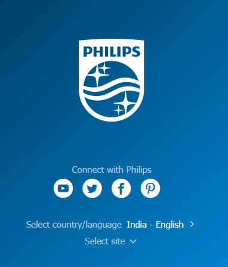

# DOM Manipulation Assignment

1. Webiste Name: [Dev To](https://dev.to/)

### Topics

    - Query Selctory, Inner HTML

### Sample Image


### Tasks

        Target the Top description div and change the DEV Community to <Your_Name> and description to your passion

### Solution
```javascript
document.querySelector(".side-bar .crayons-card .crayons-subtitle-2").innerHTML= 'Avijit Das'
document.querySelector(".side-bar .crayons-card p").innerHTML = "Hey, I'm good learner 👨‍💻, listner 👂,  coder 👨‍💻 and aslo a passionate photographer 📸 "
```
### Output


2. Website Name: [Apple](https://support.apple.com/en-in)

### Task


### Fetch all the product name and store in an array

### Solution
```javascript
const productList = document.querySelectorAll(".as-imagegrid-item-title");
const productsName = [];
productList.forEach((index)=> (productsName.push(index.innerText.replace("\nSupport", ""))));
```
### Output


3. Webiste Name: [Youtube Support](https://support.google.com/youtube/)

### Topics

    - Get Element By Id, Create Element, Create Text Node, Append Child

### Sample Image


### Tasks

     Add another FAQ 'My New FAQ' to the list

### Solution
```javascript
const myText = document.createElement('h3');
myText.textContent="My New FAQ";
mySection = document.createElement('section');
mySection.setAttribute("class","parent");
mySection.appendChild(myText);
document.querySelector('.accordion-homepage').appendChild(mySection);
```

### Output


4. Webiste Name: [OnePlus](https://www.oneplus.in/support)

### Topics

     Query Selector, InnerText

### Sample Image


### Tasks

      Change the contact number

### Solution
```javascript
document.querySelector(".one-tel-number.service-number").innerText="+91 01234 56789"
```
### Output


5. Webiste Name: [Samsung](https://www.samsung.com/in/offer/online/samsung-fest/)

### Topics

       getElementById, createElement, InnerText, append, setAttribute

### Sample Image


### Tasks

     Target the main div of card and change the Button text to Check out

### Solution
```javascript
let btnList = document.querySelectorAll('.diwali-deals-product-sale-btn')
btnList.forEach(node => node.innerHTML = "Check out")
```
### Output


6. Webiste Name: [Adidas](https://www.adidas.co.in/)

### Topics

    -   Query Selector, Event listeners, Changing Styles

### Sample Image


### Tasks

     Target the search box and on hover change thebackground color to red.

### Solution
```javascript
document.querySelector(".searchinput___zXLAR").addEventListener("mouseover", function changeColor() {document.querySelector(".searchinput___zXLAR").style.backgroundColor = "red"})
```
### Output


7. Webiste Name: [MDN Web Docs](https://developer.mozilla.org/en-US/)

### Topics

       Form, Value, Submit

### Sample Image


### Tasks

     To Search a topic in the MDN Search bar.
     First add a text to search in the search bar and then hit the submit search button to search the docs using DOM

### Solution
```javascript
document.querySelector('#hp-search-input').value = 'CSS Selectors'
document.querySelector('#hp-search-form').submit()
```
### Output


8. Webiste Name: [Google](https://www.google.com/)

### Topics

       Remove Elements

### Sample Image


### Tasks

     Remove alternate languages from the home page languages listed

### Solution
```javascript
const langList = document.querySelectorAll('#SIvCob a')
langList.forEach((element,index) => {if(index %2 == 0){langList[index].remove()}})
```
### Output


9. Webiste Name: [Code Wars](https://www.codewars.com/)

### Topics

       Change Font Family, Color of Text.

### Sample Image


### Tasks

    Change the font family of the text to monospace and text color to the logo’s background color.

### Solution
```javascript
document.querySelector('.display-heading-1').style.cssText= "font-family: monospace; color: #b1361e"
```
### Output


10. Webiste Name: [Freecodecamp](https://www.freecodecamp.org/)

### Topics

       querySelector, mouseover, click eventListener,  callback function, style,

### Sample Image


### Tasks

    Target the button and change background colour on mouseover

### Solution
```javascript
let logIn = document.querySelector('.login-btn-text') 
logIn.addEventListener("mouseover",() => {logIn.style.backgroundColor = "red"})
```
### Output


11. Webiste Name: [realme](https://www.realme.com/in/)

### Topics

       querySelector,style,background-image

### Sample Image


### Tasks

    change the realme logo to ineuron logo

### Solution
```javascript
document.querySelector(".logo .icon-logo").style.backgroundImage= "url('https://ineuron.ai/images/ineuron-logo.png')"
```
### Output


12. Webiste Name: [Github](https://github.com/)

### Topics

       querySelector,style,background-Color

### Sample Image


### Tasks

     change the background colour of the button to blue.

### Solution
```javascript
document.querySelector('.js-repos-container .btn').style.backgroundColor= 'blue'
```

### Output


13. Webiste Name: [Hackerrank](https://www.hackerrank.com/)

### Topics

       querySelector,innerHtml

### Sample Image


### Tasks

Target the top description and change “Matching developers with great companies” to ‘JSBOOTCAMP“.

### Solution
```javascript
document.querySelector('.fl-heading-text').innerHTML='JSBOOTCAMP'
```

### Output


14. Webiste Name: [Asus](https://www.asus.com/in/)

### Topics

      querySelector,style,font-size

### Sample Image


### Tasks

       change the fontsize of “Hot Deals” to 80px

### Solution
```javascript
document.querySelector('.HotDealsAll__Heading__2fIbe').style.fontSize='80px'
```
### Output


15. Webiste Name: [Dell](https://www.dell.com/en-in/shop/deals/laptop-deals?gacd=10415953-9016-5761040-285981356-0&dgc=ST&gclid=Cj0KCQjwguGYBhDRARIsAHgRm4-XUDMhhVNyHXb3s1gY4ZBzORr_d9Se-buhJwy7asyUe7YdqEA11eEaAt6UEALw_wcB&gclsrc=aw.ds&nclid=BxjBlpBQsX6pjSHh-L8YYSU77EpfXRkG1AGMB5Wbeu386ykspfrPDnfx_DdFau20)

### Topics

      querySelector,style.textAlign

### Sample Image


### Tasks

       Convert the text “G15 Gaming Laptop” from left to right

### Solution
```javascript
let titleList = document.querySelectorAll('.ps-top .ps-title')
titleList.forEach(node => node.style.textAlign = "right")
```
### Output


16. Webiste Name: [Vercel](https://vercel.com/)

### Topics

     querySelector,innerHTMl

### Sample Image


### Tasks

      change the heading “Start with the developer” to “Start with Scratch”

### Solution
```javascript
document.querySelector('.section-title_title__VEDfK').innerHTML='Start with Scratch'
```

### Output


17. Webiste Name: [Sony](https://www.sony.co.in/)

### Topics

    querySelector,innerHTMl

### Sample Image


### Tasks

     change the button text To current Date.

### Solution
```javascript
document.querySelector('.btn-container').innerHTML=Date().toString();
```

### Output


18. Webiste Name: [Philips](https://www.philips.co.in/)

### Topics

     querySelector,style,backgroundcolor

### Sample Image



### Tasks

    change the background colour blue to orange
### Solution
```javascript
document.querySelector('.p-f03-footer-container').style.backgroundColor='orange'
```
### Output


19. Webiste Name: [Canon](https://in.canon/)

### Topics

          querySelector,src

### Sample Image


### Tasks

    extract the canon logo

### Solution
```javascript
document.querySelector('.navbar-brand').innerText=document.querySelector('.navbar-brand img').src
```
### Output


20. Webiste Name: [Oppo](https://www.oppo.com/in/)

### Topics

          querySelector,style,color

### Sample Image


### Tasks

      Change the description colour black to orange

### Solution
```javascript
document.querySelector('.desc').style.color = 'orange'
```
### Output


